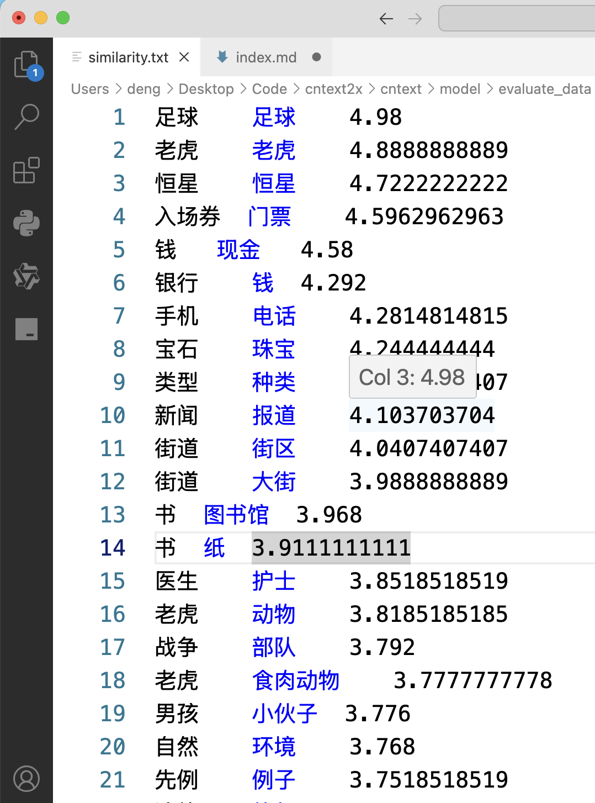
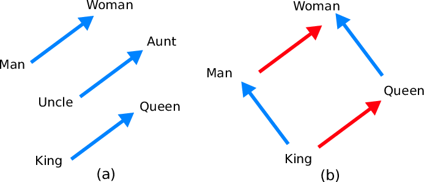
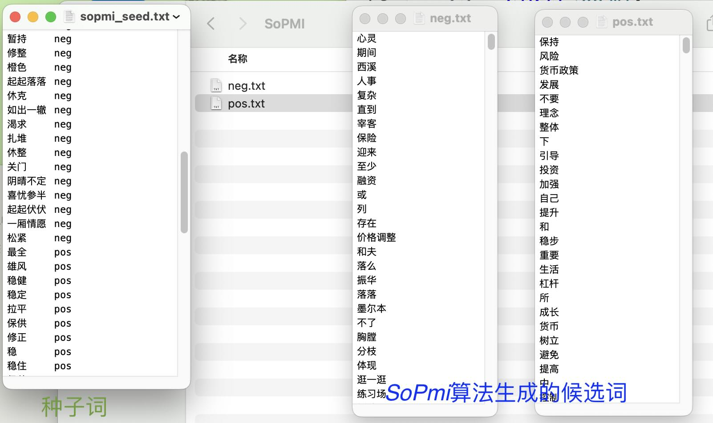

# 三、Model 模块

本部分主要内容是词嵌入模型相关技术， 包括 Word2Vec(GLove)的训练、读取、扩展词典。

| 模块        | 函数(类)                                                                     | 功能                                                                                                                                                          |
| ----------- | ---------------------------------------------------------------------------- | ------------------------------------------------------------------------------------------------------------------------------------------------------------- |
| **_model_** | **_ct.Word2Vec(corpus_file, encoding, lang, window_size, vector_size,...)_** | 训练 Word2Vec                                                                                                                                                 |
| **_model_** | **_ct.GloVe(corpus_file, encoding, lang, window_size, vector_size, ...)_**   | 训练 GLove 模型。                                                                                                                                             |
| **_model_** | **_ct.evaluate_similarity(wv, file=None)_**                                  | 使用近义法评估模型表现，默认使用内置的数据进行评估。                                                                                                          |
| **_model_** | **_ct.evaluate_analogy(wv, file=None)_**                                     | 使用类比法评估模型表现，默认使用内置的数据进行评估。                                                                                                          |
| **_model_** | **_ct.load_w2v(wv_path)_**                                                   | 读取 cntext2.x 训练出的 Word2Vec/GloVe 模型文件                                                                                                               |
| **_model_** | **_ct.glove2word2vec(glove_file, word2vec_file)_**                           | 将 GLoVe 模型.txt 文件转化为 Word2Vec 模型.txt 文件；注意这里的 GLoVe 模型.txt 是通过[Standfordnlp/GloVe](https://github.com/standfordnlp/GloVe) 训练得到的。 |
| **_model_** | **_ct.expand_dictionary(wv, seeddict, topn=100)_**                           | 扩展词典, 结果保存到路径[output/Word2Vec]中                                                                                                                   |

| **_model_** | **_ct.SoPmi(corpus_file, seed_file, lang='chinese')_** | 共现法扩展词典 |

## 3.1 Word2Vec()

可直接对原始语料 txt 文件进行自动 Word2vec 训练。该函数会自动处理文本预处理(分词、去停词)、内存管理、参数调整等问题，确保训练过程顺利进行。

在 **_gensim.models.word2vec.Word2Vec_** 基础上，增加了中英文的预处理， 简化了代码使用。配置好 cntext2.x 环境， 可以做到

- 1. 训练只用一行代码
- 2. 读取调用只用一行代码

<br>

```python
ct.Word2Vec(corpus_file,
            lang='chinese',
            dict_file=None,
            stopwords_file=None,
            vector_size=100,
            window_size=6,
            min_count=5,
            max_iter=5,
            chunksize=10000,
            only_binary=False,
            **kwargs)
```

- **_corpus_file_**: 语料库文件的路径。
- **_lang_**: 语言类型，支持 'chinese' 和 'english'，默认为 'chinese'。
- **_dict_file_**: 自定义词典 txt 文件路径，默认为 None。utf-8 编码。
- **_stopwords_file_**: 停用词文件路径，默认为 None。utf-8 编码。
- **_vector_size_**: 词向量的维度，默认为 50。
- **_window_size_**: 上下文窗口的大小，默认为 6。
- **_min_count_**: 最小词频，默认为 10。
- **_max_iter_**: 最大迭代次数，默认为 5。
- **_chunksize_**: 每次读取的行数。默认为 10000。越大速度越快。
- **_only_binary_** : 是否只保存模型为二进制文件。默认为 False， 保存为 txt 和 bin。True 时只保存 bin。
- **_kwargs_**: 其他 gensim 可选参数，如 negative、sample、hs 等。

<br>

```python
import cntext as ct

w2v = ct.Word2Vec(corpus_file = 'data/三体.txt',
                  lang = 'chinese',
                  window_size = 6,
                  vector_size = 50)


w2v
```

Run

```
Mac(Linux) System, Enable Parallel Processing
Cache output/三体_cache.txt Not Found or Empty, Preprocessing Corpus
Reading Preprocessed Corpus from output/三体_cache.txt
Start Training Word2Vec
Word2Vec Training Cost 10 s.
Output Saved To: output/Word2Vec/三体-Word2Vec.50.6.txt
```

[data/三体.txt]体积 2.7M， 训练时间 10s， 模型文件存储于 **_output/Word2Vec/三体-Word2Vec.50.6.txt_**


<br>

需要注意， **_ct.Word2Vec_** 函数十分吃内存， 使用的 2G 的中文语料 txt 文件， 几乎能吃满我服务器全部内存(256G 内存,常见电脑内存多为 8G、16G)， 出现 **_MemoryError_** 问题。 但同样的 2G 的中文语料， 运行 **_ct.GloVe_** 就轻松很多，很难出现 **_MemoryError_**。

<br>

## 3.2 GloVe()

使用 Stanford GloVe 代码工具训练 GloVe 模型。该函数会自动处理文本预处理、内存管理、参数调整等问题，确保训练过程顺利进行。

```python
ct.GloVe(corpus_file,
         lang='chinese',
         dict_file=None,
         stopwords_file=None,
         vector_size=100,
         window_size=15,
         min_count=5,
         max_memory=4.0,
         max_iter=15,
         x_max=10,
         chunksize=10000,
         only_binary=False)
```

- **_corpus_file_**: 输入语料文件路径（文本格式）。该文件为分词后的语料文件。
- **_lang_**: 语料文件的语言类型，默认为 'chinese'。
- **_dict_file_**: 自定义词典 txt 文件路径，默认为 None。utf-8 编码。
- **_stopwords_file_**: 停用词文件路径，默认为 None。utf-8 编码。
- **_vector_size_**: 词向量维度，默认 100。
- **_window_size_**: 上下文窗口大小，默认 15。
- **_min_count_**: 忽略出现次数低于此值的单词，默认 5。
- **_max_memory_**: 可供使用的最大内存大小，单位为 GB，默认 4; 该参数越大，训练越快。
- **_max_iter_**: 训练的最大迭代次数，默认 15。
- **_x_max_**: 共现矩阵中元素的最大计数值，默认 10。
- **_chunksize_**: 每次读取的行数。默认为 10000。越大速度越快。
- **_only_binary_** : 是否只保存模型为二进制文件。默认为 False， 保存为 txt 和 bin。True 时只保存 bin。

<br>

ct.GloVe 内置 [Stanford GloVe](https://nlp.stanford.edu/projects/glove/)算法， 训练速度非常快。

```python
import cntext as ct

glove = ct.GloVe(corpus_file='data/三体.txt',
                 lang='chinese',
                 vector_size=50,
                 window_size=15)

glove
```

Run

```
Mac(Linux) System, Enable Parallel Processing
Cache output/三体_cache.txt Not Found or Empty, Preprocessing Corpus
Start Training GloVe
BUILDING VOCABULARY
Using vocabulary of size 6975.

COUNTING COOCCURRENCES
Merging cooccurrence files: processed 2106999 lines.

Using random seed 1743474106
SHUFFLING COOCCURRENCES
Merging temp files: processed 2106999 lines.

TRAINING MODEL
Read 2106999 lines.
Using random seed 1743474106
04/01/25 - 10:21.46AM, iter: 001, cost: 0.055981
04/01/25 - 10:21.46AM, iter: 002, cost: 0.050632
......
04/01/25 - 10:21.48AM, iter: 014, cost: 0.030047
04/01/25 - 10:21.48AM, iter: 015, cost: 0.029100

GloVe Training Cost 9 s.
Output Saved To: output/三体-GloVe.50.15.txt
<gensim.models.keyedvectors.KeyedVectors at 0x331517440>
```


训练生成的 `output/GloVe/三体-GloVe.50.15.txt` 可用 **_ct.load_w2v_** 读取，在后面会有展示。

<br>

## 3.3 evaluate_similarity()

评估词向量模型语义相似表现。 使用 Spearman's Rank Coeficient 作为评价指标， 取值[-1, 1], 1 完全相关，-1 完全负相关， 0 毫无相关性。

cntext2.x 内置 537 条近义实验数据， 可直接使用。



```python
ct.evaluate_similarity(wv, file=None)
```

- **wv** 语料 txt 文件路径
- **file** 评估数据文件，txt 格式，默认使用 cntext 内置的评估数据文件。 txt 文件每行两个词一个数字，如下所示

<br>

```
足球	足球	4.98
老虎	老虎	4.8888888889
恒星	恒星	4.7222222222
入场券	门票	4.5962962963
空间	化学	0.9222222222
股票	电话	0.92
国王	车	0.9074074074
中午	字符串	0.6
收音机	工作	0.6
教授	黄瓜	0.5
自行车	鸟	0.5
蛋白质	文物	0.15
```

<br>

```python
import cntext as ct

# 可在 https://cntext.readthedocs.io/zh-cn/latest/embeddings.html 下载该模型文件
dm_w2v = ct.load_w2v('output/douban-movie-1000w-Word2Vec.200.15.bin')

# 使用内置评估文件
ct.evaluate_similarity(wv=dm_w2v)
# 使用自定义评估文件
# ct.evaluate_similarity(wv=dm_w2v, file='diy_similarity.txt')
```

Run

```
近义测试: similarity.txt
/Library/Frameworks/Python.framework/Versions/3.12/lib/python3.12/site-packages/cntext/model/evaluate_data/similarity.txt
Processing Similarity Test: 100%|██████████| 537/537 [00:00<00:00, 85604.55it/s]

评估结果：
+----------+------------+----------------------------+
| 发现词语 | 未发现词语 | Spearman's Rank Coeficient |
+----------+------------+----------------------------+
|   459    |     78     |            0.43            |
+----------+------------+----------------------------+
```

<br>

## 3.4 evaluate_analogy()

用于评估词向量模型在类比测试（analogy test）中表现的函数。它通过读取指定的类比测试文件，计算模型对词语关系预测的准确性，并输出每个类别的准确率、发现词语数量、未发现词语数量以及平均排名等指标。

cntext2.x 内置 1194 条类比， 格式如下



类比测试的核心是解决形如 "A : B :: C : D" 的问题，翻译过来就是"A 之于 B，似如 C 之于 D"； 即通过 AB 类比关系，找到 C 的关系词 D。该函数通过词向量模型的相似性搜索功能，计算预测结果与真实答案的匹配程度。

- 雅典之于希腊，似如巴格达之于[伊拉克]。
- 哈尔滨之于黑龙江，似如长沙之于[湖南]。
- 国王之于王后，似如男人之于[女人]。

```python
ct.evaluate_analogy(wv, file=None)
```

- **wv** 语料 txt 文件路径
- **file** 评估数据文件，txt 格式，默认使用 cntext 内置的评估数据文件。 txt 文件每行两个词一个数字，如下所示

<br>

评估数据 txt 文件格式，如下

```
: CapitalOfCountries
雅典 希腊 巴格达 伊拉克
哈瓦那 古巴 马德里 西班牙
河内 越南 伦敦 英国
: CityInProvince
石家庄 河北 南昌 江西
沈阳 辽宁 南昌 江西
南京 江苏 郑州 河南
: FamilyRelationship
男孩 女孩 兄弟 姐妹
男孩 女孩 国王 王后
父亲 母亲 国王 王后
丈夫 妻子 叔叔 阿姨
: SocialScience-Concepts
社会 社会结构 家庭 家庭结构
文化 文化传承 语言 语言传承
群体 群体行为 组织 组织行为
```

<br>

```python
# 使用内置评估文件
ct.evaluate_analogy(wv=dm_w2v)
# 使用自定义评估文件
# ct.evaluate_analogy(wv=dm_w2v, file='diy_analogy.txt')
```

Run

```
类比测试: analogy.txt
/Library/Frameworks/Python.framework/Versions/3.12/lib/python3.12/site-packages/cntext/model/evaluate_data/analogy.txt
Processing Analogy Test: 100%|█████████████| 1198/1198 [00:11<00:00, 103.52it/s]

评估结果：
+--------------------+----------+------------+------------+----------+
|      Category      | 发现词语 | 未发现词语 | 准确率 (%) | 平均排名 |
+--------------------+----------+------------+------------+----------+
| CapitalOfCountries |   615    |     62     |   39.02    |   2.98   |
|   CityInProvince   |   175    |     0      |   28.57    |   4.74   |
| FamilyRelationship |   272    |     0      |   92.65    |   1.48   |
|   SocialScience    |    8     |     62     |   25.00    |   6.00   |
+--------------------+----------+------------+------------+----------+
```

豆瓣电影在 FamilyRelationship 评估中表现较好，大概率是因为电影主要反映的是人与人之间的关系，覆盖了绝大多数 FamilyRelationship 家庭类比关系，所以类比表现巨好，但在其他方面表现较差。

如果是维基百科语料，可能在 CapitalOfCountries、CityInProvince、SocialScience 中表现较好。

<br>

## 3.5 SoPmi()

```python
ct.SoPmi(corpus_file, seed_file)       #人工标注的初始种子词
```

- **corpus_file** 语料 txt 文件路径
- **seed_file** 初始种子词 txt 文件路径

共现法

```python
import cntext as ct

ct.SoPmi(corpus_file='data/sopmi_corpus.txt',
         seed_file='data/sopmi_seed.txt')       # 人工标注的初始种子词

```

Run

```
Step 1/4:...Preprocess   Corpus ...
Step 2/4:...Collect co-occurrency information ...
Step 3/4:...Calculate   mutual information ...
Step 4/4:...Save    candidate words ...
Finish! used 19.74 s
```



<br>

## 3.6 load_w2v()

导入 cntext2.x 预训练的 word2vec 模型 .txt 文件

```python
ct.load_w2v(w2v_path)
```

- **w2v_path** 模型文件路径

读取 **_output/三体.100.6.txt_** 模型文件, 返回 `gensim.models.word2vec.Word2Vec` 类型。

```python
import cntext as ct

santi_w2v = ct.load_w2v(w2v_path='output/三体-Word2Vec.50.6.bin')
# santi_w2v = ct.load_wv(wv_path='output/三体-Word2Vec.50.6.txt')

santi_glove = ct.load_w2v(w2v_path='output/三体-GloVe.50.15.bin')
# santi_glove = ct.load_wv(wv_path='output/三体-GloVe.50.15.bin')

santi_w2v
```

Run

```
Loading output/三体-Word2Vec.50.6.bin...
Loading output/三体-GloVe.50.15.bin...
<gensim.models.keyedvectors.KeyedVectors at 0x33aa9cf80>
```

<br>

## 3.7 glove2word2vec()

将 GLoVe 模型.txt 文件转化为 Word2Vec 模型.txt 文件； 除非从网络下载的 GloVe 模型资源， 否则一般情况用不到这个函数。

```python
ct.glove2word2vec(glove_file, word2vec_file)
```

- **_glove_file_**: GLoVe 模型.txt 文件路径
- **_word2vec_file_**: Word2Vec 模型.txt 文件路径

<br>

注意这里的 GLoVe 模型.txt 是通过[Standfordnlp/GloVe](https://github.com/standfordnlp/GloVe) 训练得到的

<br>

```python
import cntext as ct
ct.glove2word2vec(glove_file='data/GloVe.6B.50d.txt',
                  word2vec_file='output/word2vec_format_GloVe.6B.50d.txt')
```

<br>

## 注意

- **_ct.load_w2v()_** 导入后得到的数据类型是 **_gensim.models.keyedvectors.KeyedVectors_** 。
- **_gensim.models.word2vec.Word2Vec_** 可以转化为 **_gensim.models.keyedvectors.KeyedVectors_** ，

<br>

## 3.8 expand_dictionary()

```python
ct.expand_dictionary(wv,  seeddict, topn=100)
```

- **wv** 预训练模型，数据类型为 gensim.models.keyedvectors.KeyedVectors。
- **seeddict** 参数类似于种子词；格式为 PYTHON 字典；
- **topn** 返回 topn 个语义最接近 seeddict 的词

根据设置的 seeddict, 可按类别扩展并生成对应的词典 txt 文件， txt 文件位于[output]文件夹内。

```python
seeddict = {
    '人物': ['叶文洁', '史强', '罗辑'],
    '物体': ['飞船', '车辆']
}


ct.expand_dictionary(wv=santi_w2v.wv,
                     seeddict=seeddict,
                     topn=10)
```


