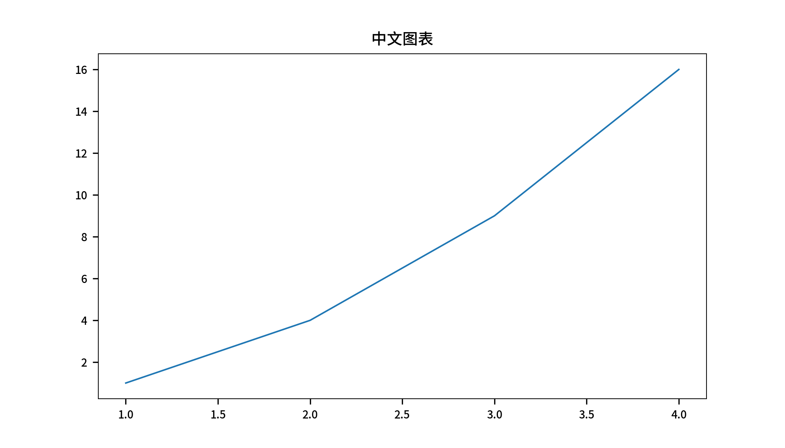
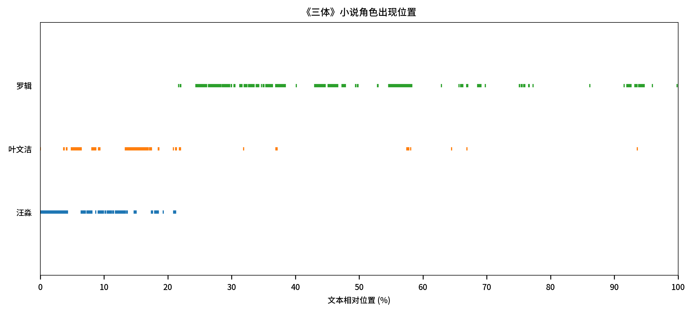
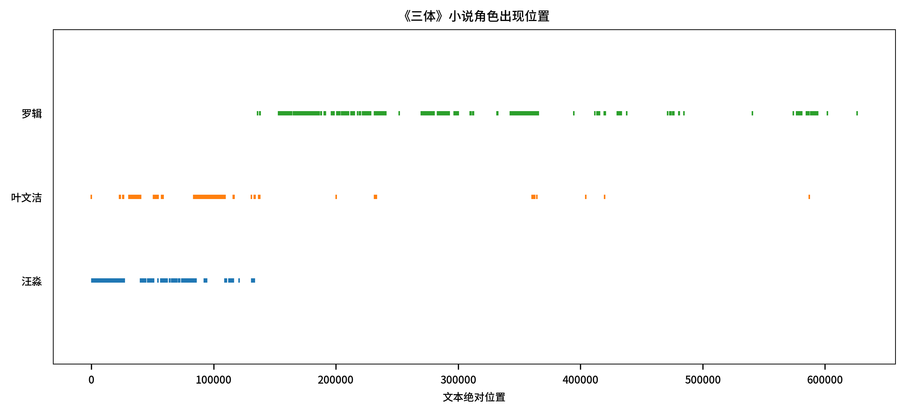

# 七、Plot模块
| 模块 | 函数                                        | 功能                                        |
| -------- | ------------------------------------------- | ------------------------------------------- |
| ***plot*** | ``ct.matplotlib_chinese()``  | 支持matplotlib中文绘图 |
| ***plot*** | ``ct.lexical_dispersion_plot1(text, targets_dict, lang, title, figsize)``  | 对某一个文本text， 可视化不同目标类别词targets_dict在文本中出现位置  |
| ***plot*** | ``ct.lexical_dispersion_plot2(texts_dict, targets, lang, title, figsize)``  | 对某几个文本texts_dict， 可视化某些目标词targets在文本中出现相对位置(0~100)  |

<br>


## 7.1 matplotlib_chinese()

matplotlib默认不支持中文可视化， cntext新增该函数，可以解决中文可视化问题

```python
import cntext as ct

plt = ct.matplotlib_chinese()
plt.figure(figsize=(7, 4))
plt.plot([1, 2, 3, 4], [1, 4, 9, 16])
plt.title('中文图表', fontsize=10)
plt.show()
```


<br>

## 7.2 lexical_dispersion_plot1()

词汇分散图可视化， 对某一个文本text， 可视化不同目标类别词targets_dict在文本中出现位置

```python
ct.lexical_dispersion_plot1(text, targets_dict, lang='chinese', figsize=(12, 6), title='特定词汇在不同文本来源的相对离散图', prop=True)
```

- ***text***: 文本数据
- ***targets_dict***:  目标类别词字典； targets_dict={'pos': ['开心', '快乐'], 'neg': ['悲伤', '难过']}
- ***lang***: 文本数据texts_dict的语言类型，默认'chinese'.
- ***figsize***: 图的长宽尺寸. 默认 (8, 5).
- ***title*** : 图的标题；
- ***prop***: 横坐标字符位置是否为相对位置. 默认True，横坐标索引值取值范围0 ~ 100

<br>

点击下载 [**三体.txt**](https://textdata.cn/data/三体.txt)、[**基地.txt**](https://textdata.cn/data/基地.txt)两本小说文件。


<br>

```python
import cntext as ct

roles_dict = {
    "汪淼": ['汪淼'],
    "叶文洁": ['叶文洁'],
    "罗辑": ['罗辑']
}

santi_text = open('三体.txt', encoding='utf-8').read()

ax = ct.lexical_dispersion_plot1(text = santi_text,  #文本数据
                            targets_dict = roles_dict, #角色
                            figsize = (10, 4),  #尺寸大小
                            lang = 'chinese',  #中文数据
                            title = '《三体》小说角色出现位置', #标题
                            prop = True)    #相对位置(横坐标轴取值范围0-100)
ax
```



<br>

```python
ct.lexical_dispersion_plot1(text = santi_text,  #文本数据
                            targets_dict = roles_dict, #角色
                            figsize = (10, 4),  #尺寸大小
                            lang = 'chinese',  #中文数据
                            title = '《三体》小说角色出现位置', #标题
                            prop = False)    #绝对位置(横坐标轴取值范围与小说文本长度有关)
```



<br>

```python
import cntext as ct

# diy了一个小词典
senti_dict = {
    'pos': ['开心', '幸福', '快乐', '安宁', '希望'],
    'neg': ['紧张', '恐惧', '害怕', '绝望']
}

santi_text = open('三体.txt', encoding='utf-8').read()

ax = ct.lexical_dispersion_plot1(text = santi_text, 
                            targets_dict = senti_dict, 
                            figsize = (10, 2), 
                            lang = 'chinese', 
                            title = '《三体》情绪词出现位置',
                            prop = True)
ax
```


<br>

## 7.3 lexical_dispersion_plot2()

词汇分散图可视化， 对某几个文本texts_dict， 可视化某些目标词targets在文本中出现相对位置(0~100)

```python
ct.lexical_dispersion_plot2(texts_dict, targets, lang='chinese', figsize=(12, 6), title='特定词汇在不同文本来源的相对离散图')
```

- ***texts_dict***: 多个文本的字典数据。形如{'source1': 'source1的文本内容', 'source2': 'source2的文本内容'}
- ***targets***: 目标词列表
- ***lang***: 文本数据texts_dict的语言类型，默认'chinese'.
- ***figsize***: 图的长宽尺寸. 默认 (8, 5).
- ***title*** : 图的标题；

<br>

```python
targets = ['太空', '宇宙']

texts_dict = {'三体': open('三体.txt', encoding='utf-8').read(),
              '基地': open('基地.txt', encoding='utf-8').read()}

ax = ct.lexical_dispersion_plot2(texts_dict = texts_dict,
                            targets = targets, 
                            figsize = (10, 2), 
                            title = '"太空/宇宙"词语出现位置',
                            lang = 'chinese')
ax
```


